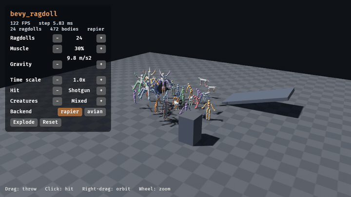

<div align="center">

# bevy_ragdoll

Active ragdolls for [Bevy] on any skeleton and physics engine.

[](https://github.com/sagan-software/bevy-ragdoll/actions/workflows/ci.yml)
[](https://sagan-software.github.io/bevy-ragdoll/)
[](https://sagan-software.github.io/bevy-ragdoll/coverage/)
[](https://crates.io/crates/bevy_ragdoll)
[](https://docs.rs/bevy_ragdoll)
[](https://bevy.org)
[](#license)

**[Live examples](https://sagan-software.github.io/bevy-ragdoll/)** ·
**[Documentation](https://docs.rs/bevy_ragdoll)** ·
**[Changelog](CHANGELOG.md)**

[](https://sagan-software.github.io/bevy-ragdoll/examples/showcase/)

</div>

> [!NOTE]
> bevy_ragdoll is in development and not yet published. The API changes often.

## Features

- Ragdolls for any skeleton: `Ragdoll::default()` generates bodies, shapes, masses, and joints from the bones it finds, for humans, quadrupeds, or a seven-legged alien.
- Active control: joint muscles drive bodies toward the animated pose, and pins hold chosen bodies in place.
- Hit reactions: presets from pistol to explosion weaken muscles locally and spread the impulse through the body.
- Partial ragdolls: keep some bodies animated while others go limp.
- Backend-neutral core: the runtime talks to the physics engine through a small adapter contract.
- Runs on desktop and in the browser (WebAssembly with WebGL2).

## Quick start

```toml
[dependencies]
bevy = "0.19"
bevy_ragdoll = { git = "https://github.com/sagan-software/bevy-ragdoll" }
bevy_ragdoll_rapier3d = { git = "https://github.com/sagan-software/bevy-ragdoll" }
bevy_rapier3d = "0.36"
```

```rust
use bevy::prelude::*;
use bevy_ragdoll::runtime::components::RagdollMode;
use bevy_ragdoll::{Ragdoll, RagdollDebugPlugin, RagdollPlugin};
use bevy_ragdoll_rapier3d::{RapierRagdollHooks, RapierRagdollPlugin};
use bevy_rapier3d::prelude::*;

fn main() {
    App::new()
        .add_plugins(DefaultPlugins)
        .add_plugins((
            RagdollPlugin::default(),
            RapierPhysicsPlugin::<RapierRagdollHooks>::default().in_fixed_schedule(),
            RapierRagdollPlugin,
            RagdollDebugPlugin,
        ))
        .add_systems(Startup, |mut commands: Commands, assets: Res<AssetServer>| {
            // Any skinned glTF works; the ragdoll is generated from its skeleton.
            let scene = assets.load(GltfAssetLabel::Scene(0).from_asset("character.glb"));
            commands.spawn((WorldAssetRoot(scene), Ragdoll::default(), RagdollMode::Dynamic));
        })
        .run();
}
```

[`examples/minimal.rs`](examples/minimal.rs) is a complete program with a floor and a camera.

## Backends

| Backend   | Crate                   | Engine                | Status      | Web |
| --------- | ----------------------- | --------------------- | ----------- | --- |
| Rapier 3D | `bevy_ragdoll_rapier3d` | `bevy_rapier3d` 0.36  | Available   | Yes |
| Avian 3D  | `bevy_ragdoll_avian3d`  | `avian3d` 0.7         | Available   | Yes |
| Custom    | your crate              | any                   | Supported   | Depends |

A custom backend creates bodies and joints for the runtime's body entities and reports their poses back.
[`examples/custom_backend.rs`](examples/custom_backend.rs) runs the core on a small mock backend.

## Examples

Every example except Profile Builder runs in the browser.

| Example | Demo | Description |
| ------- | ---- | ----------- |
| [`showcase`](examples/showcase.rs) | [Play](https://sagan-software.github.io/bevy-ragdoll/examples/showcase/) | Throw, hit, and tune a crowd of ragdolls while watching frame and step cost. |
| [`minimal`](examples/minimal.rs) | [Play](https://sagan-software.github.io/bevy-ragdoll/examples/minimal/) | Drop the reference humanoid ragdoll and inspect its landing and joints. |
| [`from_code`](examples/from_code.rs) | [Play](https://sagan-software.github.io/bevy-ragdoll/examples/from_code/) | Build and run a pinned three-body chain from Rust. |
| [`from_gltf`](examples/from_gltf.rs) | [Play](https://sagan-software.github.io/bevy-ragdoll/examples/from_gltf/) | Generate ragdolls from skinned glTF creatures with no authored files. |
| [`profile_builder`](examples/profile_builder.rs) | | Build and validate a one-body profile without an app. |
| [`custom_backend`](examples/custom_backend.rs) | [Play](https://sagan-software.github.io/bevy-ragdoll/examples/custom_backend/) | Run the core runtime on a mock backend. |
| [`hit_reactions`](examples/hit_reactions.rs) | [Play](https://sagan-software.github.io/bevy-ragdoll/examples/hit_reactions/) | Select hit profiles, click the rig, and edit local muscle and pin strengths. |
| [`partial_ragdoll`](examples/partial_ragdoll.rs) | [Play](https://sagan-software.github.io/bevy-ragdoll/examples/partial_ragdoll/) | Keep the legs driven while impacts move the loose upper body. |
| [`ragdoll_stress`](examples/ragdoll_stress.rs) | [Play](https://sagan-software.github.io/bevy-ragdoll/examples/ragdoll_stress/) | Drop many ragdolls and report frame and physics-step cost. |

Run one locally:

```sh
cargo run --release --example showcase
```

## Custom skeletons

`Ragdoll::default()` reads the skeleton under the character and generates a ragdoll profile: one body per bone, with shapes, masses, and joint limits.
Humanoids with UE mannequin bone names get the humanoid layout; other rigs are classified by topology, so quadrupeds and creatures with extra limbs work too ([`from_gltf`](examples/from_gltf.rs)).
To tune one bone, add a `RagdollBone` override to it, or build a profile in Rust ([`from_code`](examples/from_code.rs)).

## Bevy compatibility

| bevy_ragdoll | Bevy |
| ------------ | ---- |
| `main`       | 0.19 |

## License

Licensed under either the [Apache License, Version 2.0](LICENSE-APACHE) or the [MIT license](LICENSE-MIT) at your option.

Unless you explicitly state otherwise, any contribution intentionally submitted for inclusion in this crate by you, as defined in the Apache-2.0 license, shall be dual licensed as above, without any additional terms or conditions.

[Bevy]: https://bevy.org
