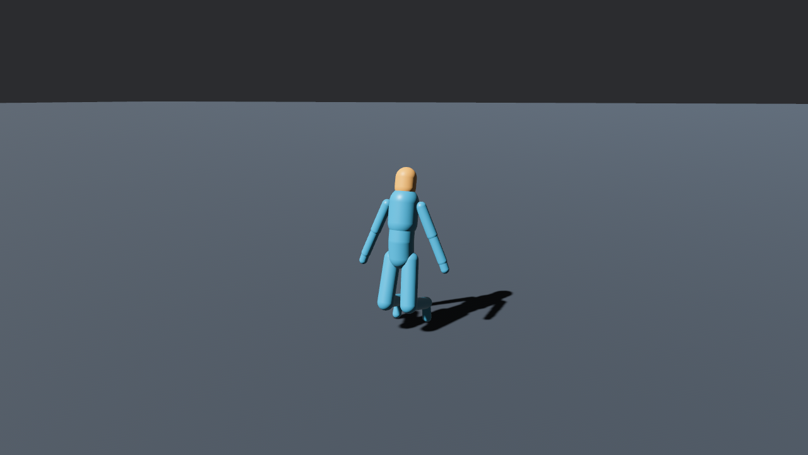
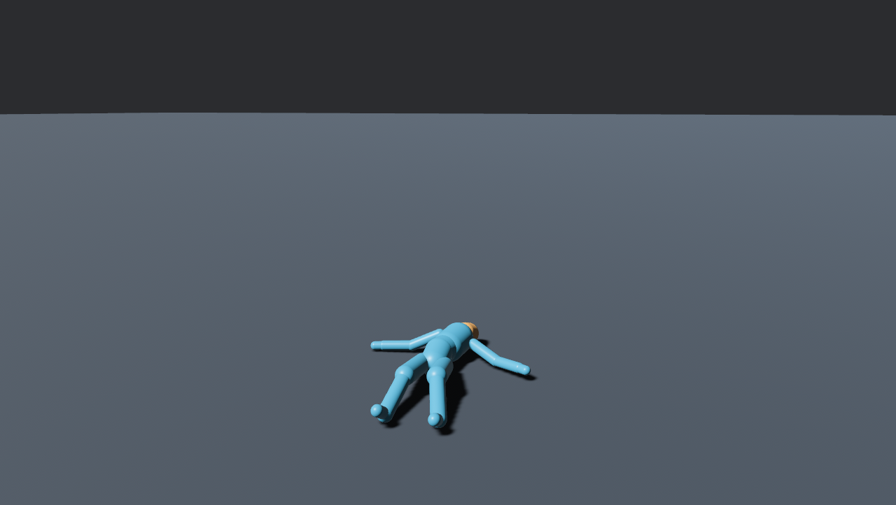

# Rapier powered ragdoll spike

The spike tested the TGF human profile with `bevy_rapier3d` at a fixed 60 Hz
for 10 seconds (600 steps). Each ragdoll has 16 bodies and 15 joints. Runs
used the 4 Hz natural frequency unless noted. The matrix compares Rapier's
`AccelerationBased` joint motors with a torque controller, muscle strength,
pelvis pin strength, and ragdoll count.

## Results

Mean and maximum joint angle errors are in degrees. Pelvis drift is the
maximum absolute difference from target height, in metres. Step times
are per fixed step. Every row recorded zero unstable bodies, defined as a
body moving faster than 50 m/s or with a non-finite speed.

| Run | Mean error | Max error | Drift m | Unstable |
| --- | ---: | ---: | ---: | ---: |
| Motor pin 0 | 5.420 | 80.243 | 0.8404 | 0 |
| Motor pin 0.5 | 5.804 | 76.197 | 0.8403 | 0 |
| Motor pin 1 | 6.016 | 70.129 | 0.8401 | 0 |
| Torque pin 0 | 8.424 | 94.167 | 0.8420 | 0 |
| Torque pin 0.5 | 8.747 | 113.823 | 0.8438 | 0 |
| Torque pin 1 | 8.654 | 84.930 | 0.8425 | 0 |
| Limp drop | 13.391 | 111.580 | 0.8403 | 0 |
| Motor 6 Hz | 3.342 | 37.966 | 0.1936 | 0 |
| Stress count 1 | 3.342 | 37.966 | 0.1936 | 0 |
| Stress count 32 | 3.281 | 66.924 | 0.1979 | 0 |
| Stress count 128 | 3.270 | 95.020 | 0.2919 | 0 |

| Run | Mean ms | P95 ms |
| --- | ---: | ---: |
| Motor pin 0 | 0.1830 | 0.2029 |
| Motor pin 0.5 | 0.1480 | 0.1862 |
| Motor pin 1 | 0.1320 | 0.1749 |
| Torque pin 0 | 0.1156 | 0.1354 |
| Torque pin 0.5 | 0.1272 | 0.1472 |
| Torque pin 1 | 0.1300 | 0.1544 |
| Limp drop | 0.1403 | 0.1703 |
| Motor 6 Hz | 0.1096 | 0.1263 |
| Stress count 1 | 0.1162 | 0.1243 |
| Stress count 32 | 2.1303 | 2.2959 |
| Stress count 128 | 10.1756 | 10.6003 |

The best mean joint error was 3.270° at 128 ragdolls; its pelvis drift was
0.2919 m. The best single-ragdoll row was the 6 Hz motor run, with 3.342°
mean error and 0.1936 m drift. No row met both target thresholds of mean
joint error below 5° and pelvis drift below 0.05 m. All rows had zero
unstable bodies. At 128 ragdolls the p95 step time was 10.6003 ms, below
the 16.67 ms fixed-step interval on this machine.

The 6 Hz motor reduced mean joint error from 6.016° to 3.342° versus the
4 Hz pinned motor run, while pelvis drift fell from 0.8401 m to 0.1936 m.
The remaining drift suggests that the pinned whole-chain pose does not
counter gravity well enough. The spike did not isolate pin stiffness,
anchor placement, or target-pose distribution as the cause.

The `AccelerationBased` motor is the recommended default for the core
runtime. It had lower mean joint error than torque drive at every matching
4 Hz pin setting. The motor figure also remained upright in its screenshot;
the torque figure had fallen onto the ground by the capture time.

## Screenshots

Both images came from the running Bevy window, captured at 5 seconds in a
1280 by 800 window using Vulkan on the AMD RADV VANGOGH device. The motor
image used muscle 1, pin 1, and 4 Hz. The torque image used the same settings.





The visible rig uses capsule geometry from the profile. The torso and limbs
show capsule seams at the joints, the figure occupies a small part of the
frame, and the flat ground plane and hard shadow dominate the scene. The
motor figure remains upright; the torque figure lies on the ground. These
screenshots verify visible examples and expose their current presentation
limits.

## Reproduction and evidence

The focused tests and visual build used the configured SD-card Cargo paths:

```sh
CARGO_HOME=/var/mnt/nixsd/Caches/cargo \
CARGO_TARGET_DIR=/var/mnt/nixsd/Build/bevy-ragdoll \
CARGO_BUILD_JOBS=4 \
nix develop -c cargo test -p bevy_ragdoll_examples \
  --example spike_rapier_powered --features visual

CARGO_HOME=/var/mnt/nixsd/Caches/cargo \
CARGO_TARGET_DIR=/var/mnt/nixsd/Build/bevy-ragdoll \
CARGO_BUILD_JOBS=4 \
nix develop -c cargo build -p bevy_ragdoll_examples \
  --example spike_rapier_powered --features visual
```

The 1, 32, and 128 ragdoll scenarios used the `stress-test` profile. Their
JSON reports, along with every single-ragdoll matrix report, are in
[`results/`](results/). The spike source is
[`examples/spike_rapier_powered.rs`](../../examples/spike_rapier_powered.rs).

The visual test target passed all 10 tests. LLVM coverage also exited 0,
but its report omitted `examples/spike_rapier_powered.rs` and listed
coverage only for the core library. It therefore provides no line or branch
coverage for the spike implementation. Runtime tests and the two visible
captures passed; example-source coverage remains unmeasured.
